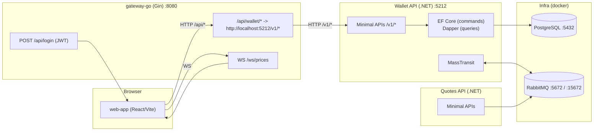

# Finance Platform

Plataforma de finanças com **Gateway em Go**, **APIs em .NET (Wallet/Quotes)** e **frontend em React**, preparada para rastreabilidade via `X-Correlation-ID`, mensageria (RabbitMQ) e persistência (PostgreSQL).

## Visão geral

- **Frontend**: `web-app` (React + TypeScript + Vite + Tailwind)
- **Gateway**: `gateway-go` (Go + Gin)
  - Emite JWT via `POST /api/login`
  - Protege rotas `/api/**` com `Authorization: Bearer ...`
  - Reverse proxy com rewrite: `/api/wallet/*` → Wallet API `/v1/*`
  - WebSocket: `/ws/prices` para updates de preço em tempo real
- **Wallet API**: `services/wallet-api` (.NET, Minimal APIs, Clean Architecture)
  - Persistência: EF Core (comandos) + Dapper (consultas rápidas quando aplicável)
  - Mensageria: MassTransit/RabbitMQ para eventos de preço
- **Quotes API**: `services/quotes-api` (.NET, Minimal APIs, Clean Architecture)
- **Infra**: `infra/docker-compose.yml` (PostgreSQL + RabbitMQ)

## Diagrama (Mermaid)



## Pré-requisitos

- **Node.js** (use o `.nvmrc` como referência)
- **Go** (compatível com o `go.mod` do `gateway-go`)
- **.NET SDK** (conforme os projetos em `services/*`)
- **Docker Desktop** (para Postgres e RabbitMQ)

## Como rodar (dev)

### 1) Subir infraestrutura

```bash
docker compose -f infra/docker-compose.yml up -d
```

### 2) Subir Wallet API

```bash
cd services/wallet-api/Wallet.Api
dotnet run --urls http://localhost:5212
```

### 3) Subir Gateway

```bash
cd gateway-go
go run ./cmd/gateway
```

### 4) Subir Frontend

```bash
cd web-app
npm install
npm run dev
```

## O que você deve fazer agora

Recarregue a página e teste novamente o Dashboard.

Se ainda der 401, rode no console do browser:

```js
localStorage.removeItem("token")
location.reload()
```

Isso força o `ensureAuthToken()` a fazer um novo `/api/login` e gravar um token novo antes do `getAssets`.

## Portas e endpoints úteis

- **Frontend**: Vite dev server (porta exibida no terminal, geralmente `5173`)
- **Gateway**: `http://localhost:8080`
  - `POST /api/login` (público)
  - `GET /api/wallet/assets` (protegido por JWT)
  - `POST /api/wallet/assets/buy` (protegido por JWT)
  - `WS ws://localhost:8080/ws/prices`
- **Wallet API**: `http://localhost:5212` (endpoints `GET/POST /v1/*`)
- **Postgres**: `localhost:5432` (DB `wallet_db`)
- **RabbitMQ Management**: `http://localhost:15672` (guest/guest)

## Script de teste (E2E)

Há um script PowerShell para validar o fluxo **Gateway + Wallet** (login → listar ativos → comprar ativo → comprar novamente no mesmo ticker):

```powershell
.\scripts\test-gateway-wallet.ps1
```

## Padrões de desenvolvimento

Veja `.cursorrules` para as regras e convenções do projeto (Clean Architecture, Result pattern, logs com `X-Correlation-ID`, etc.).

